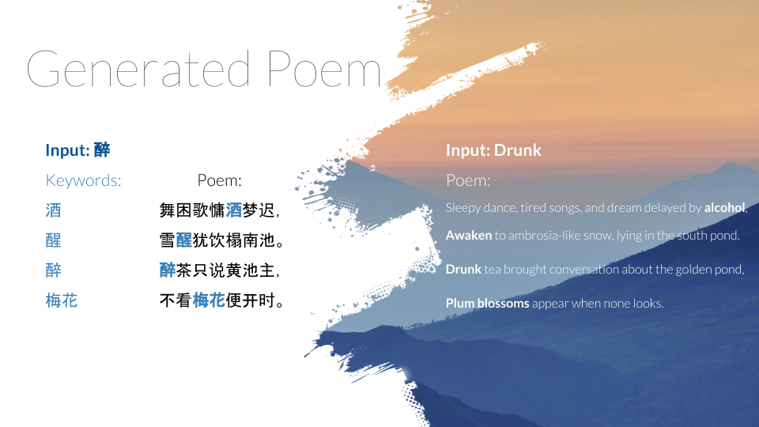

## New information(2018/02/24)
- To run server of couplets, use "python3 couplet_gen/seq_learning.py" with Tensorflow==1.0.0
- To run client of s2s poetry generator, use "python2 cpython2 main.py" with Tensorflow==1.2.1. 
- The model are empty now. Please make sure the models are stored in correct folders before evaluation; or train from empty.
** TODO list **
Zijian: Update word embeddings for poetry with rhymes.
Ran: Force rhymes of last character for couplet.


# Chinese Poetry Generation
This project aims to implement and improve upon the classical Chinese poetry generation system proposed in ["Chinese Poetry Generation with Planning based Neural Network"](https://arxiv.org/abs/1610.09889). 

## Generated Sample


## Dependencies
[Python 2.7](https://www.python.org/download/releases/2.7/)  
[TensorFlow 1.2.1](https://www.tensorflow.org/)  
[Jieba 0.38](https://github.com/fxsjy/jieba)  
[Gensim 2.0.0](https://radimrehurek.com/gensim/)  
[pypinyin 0.23](https://pypi.python.org/pypi/pypinyin)  

## Features
**Network:**
- [x] Bidirectional encoder
- [x] Attention decoder

**Training and Predicting:**
- [x] Alignment boosted word2vec
- [x] Data loading mode: only keywords (no preceding sentences)
- [x] Data loading mode: reversed
- [x] Data loading mode: aligned
- [x] Training mode: ground truth
- [x] Training mode: scheduled sampling
- [x] Predicting mode: greedy
- [x] Predicting mode: sampling
- [ ] Predicting mode: beam search

**Refinement:**
- [x] Output refiner
- [ ] Reinforcement learning tuner
- [ ] Iterative polishing

**Evaluation:**
- [x] Evaluation: rhyming
- [x] Evaluation: tonal structure
- [ ] Evaluation: alignment score
- [ ] Evaluation: BLEU score


## Project Structure
**Data**  
`data`: directory for `raw` data, `processed` data, pre-processed `starterkit` data, and generated poetry `samples`  
`model`: directory for saved neural network models  
`log`: directory for training logs  
`notebooks`: directory for exploratory/experimental IPython notebooks  
`training_scripts`: directory for sample scripts used for training several basic models  

**Code**  
`model.py`: graph definition  
`train.py`: training logic  
`predict.py`: prediction logic  
`plan.py`: keyword planning logic  
`main.py`: user interaction program  

## Data Processing
To prepare training data:
```sh
python data_utils.py
```

> **Detail**  
> This scrip does the following in order:    
> 1. Parse corpus  
> 2. Build vocab  
> 3. Filter quatrains  
> 4. Count words  
> 5. Rank words  
> 6. Generate training data  

> **Note**  
> The TextRank algorithm may take many hours to run.  
> Instead, you can choose to interrupt the iterations and stop it early,  
> when the progress shown in the terminal has remained stationary for a long time.  
  
Then, to generate the word embedding:
```sh
python word2vec.py
```

> **Alternative**  
> As an alternative, we have also provided pre-processed data in the `data/starterkit` directory  
> You may simply perform `cp data/starterkit/* data/processed` to skip the data processing step  

## Training

To train the default model:
```sh
python train.py
```

To view the full list of configurable training parameters:
```sh
python train.py -h
```

> **Note**  
> Thus you should almost always train a new model after modifying any of the parameters.  
> Models are by default saved to `model/`. To train a new model, you may either remove the existing model from `model/`  
> or specify a new model path during training with `python train.py --model_dir :new_model:dir:`  


## Generating

To start the user interation program:
```sh
python main.py
```

Similarly, to view the full list of configurable predicting parameters:
```sh
python main.py -h
```

> **Note**  
> The program currently does not check that predication parameters matches corresponding training parameters.  
> User has to ensure, in particular, the data loading modes correspond with the ones used during traing.  
> (e.g. If training data is `reversed` and `aligned`, then prediction input should also be `reversed` and `aligned`.  
> Otherwise, results may range from subtle differences in output to total crash.  

## Evaluating

To generate sample poems for evaluation:
```sh
python generate_samples.py
```

> **Detail**  
> This script by default randomly samples 4000 poems from the training data and saves them as `human` poems.
> Then it uses entire poems as inputs to the planner, to create keywords for the predictor.
> The predicted poems are saved as `machine` poems.

To evaluate the generated poems:
```sh
python evaluate.py
```


## Further Reading
**Auxiliary**  
1. ["Scheduled Sampling for Sequence Prediction with Recurrent Neural Networks"](https://arxiv.org/abs/1506.03099)
2. ["Sequence-to-Sequence Learning as Beam-Search Optimization"](https://arxiv.org/abs/1606.02960)
3. ["Tuning Recurrent Neural Networks with Reinforcement Learning"](https://arxiv.org/pdf/1611.02796v2.pdf)
4. ["Deep Reinforcement Learning for Dialogue Generation"](https://arxiv.org/pdf/1606.01541.pdf)

**Poetry Generation**
1. May 10, 2017: ["Flexible and Creative Chinese Poetry Generation Using Neural Memory"](https://arxiv.org/pdf/1705.03773.pdf)
2. Dec 7, 2016: ["Chinese Poetry Generation with Planning based Neural Network"](https://arxiv.org/pdf/1610.09889.pdf)
3. June 19, 2016: ["Can Machine Generate Traditional Chinese Poetry? A Feigenbaum Test"](https://arxiv.org/pdf/1606.05829.pdf)

## Acknowledgement
1. The data processing source code is based on [DevinZ1993](https://github.com/DevinZ1993/Chinese-Poetry-Generation)'s implementation.
2. The neural network implementation is inspired by [JayParks](https://github.com/JayParks/tf-seq2seq)'s work.
